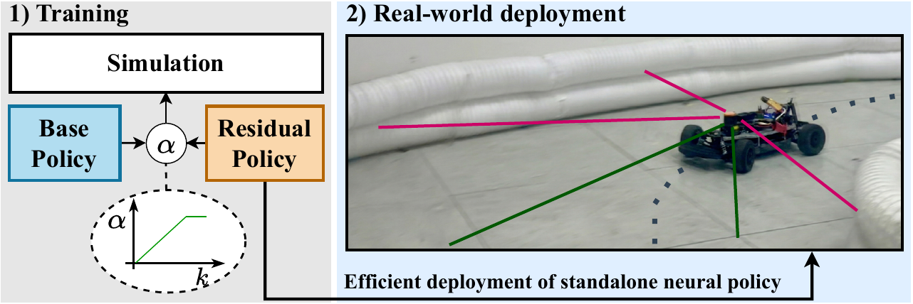

# aRPO_racing

[](https://github.com/RichardLitt/standard-readme)

This repository is the official implementation of the [paper](https://arxiv.org/abs/2603.12960):

> **Efficient Real-World Autonomous Racing via Attenuated Residual Policy Optimization**
> 
> [Trumpp, Raphael](https://scholar.google.com/citations?user=2ttMbLQAAAAJ&hl=en), 
> [Denis Hoornaert](https://scholar.google.com/citations?user=mGueMPgAAAAJ&hl=en),
> [Mirco Theile](https://scholar.google.com/citations?user=88rL5TUAAAAJ&hl=en),
> and [Marco Caccamo](https://scholar.google.com/citations?user=Jbo1MqwAAAAJ&hl=en&oi=ao).

Under submission.

Full code will be released after acceptance.

<p align="center">
  
  <br/>
  <em>We test our proposed &alpha;-RPO method by learning competitive real-world racing behavior with 1:10-scaled autonomous Roboracer cars.<br>
  Compared to classical RPL, &alpha;-RPO attenuates the contribution of the base policy during training, improving final performance while yielding a standalone neural policy at inference time for efficient deployment.</em>
</p>

## Table of contents
- [Background](#background)
- [Install](#install)
- [Usage](#usage)
- [Reference](#reference)
- [License](#license)

## Background
Residual policy learning (RPL), in which a learned policy refines a static base policy using deep reinforcement learning (DRL), has shown strong performance across various robotic applications.
Its effectiveness is particularly evident in autonomous racing, a domain that serves as a challenging benchmark for real-world DRL.
However, deploying RPL-based controllers introduces system complexity and increases inference latency.
We address this by introducing an extension of RPL named attenuated residual policy optimization ($\alpha$-RPO).
Unlike standard RPL, $\alpha$-RPO yields a standalone neural policy by progressively attenuating the base policy, which initially serves to bootstrap learning.
Furthermore, this mechanism enables a form of privileged learning, where the base policy is permitted to use sensor modalities not required for final deployment.
We design $\alpha$-RPO to integrate seamlessly with PPO, ensuring that the attenuated influence of the base controller is dynamically compensated during policy optimization.
We evaluate $\alpha$-RPO by building a framework for 1:10-scaled autonomous racing around it.
In both simulation and zero-shot real-world transfer to Roboracer cars, $\alpha$-RPO not only reduces system complexity but also improves driving performance compared to baselines---demonstrating its practicality for robotic deployment.

<p align="center">
  <video src="https://github.com/raphajaner/aRPO_racing/blob/main/docs/real_world_video.mp4?raw=true" width="600" controls></video>
  <br/>
  <em>The &alpha;-RPO agent autonomously navigating the real-world track.</em>
</p>

## Install
- We recommend to use a virtual environment for the installation:
  ```bash
  python -m venv arpo_racing_env
  source arpo_racing_env/bin/activate
  ```
- Activate the environment and install the following packages:
    ```bash
  pip install -U pip
  pip install torch
  pip install tensordict 
  pip install torchrl
  pip install torchinfo
  pip install matplotlib
  pip install gymnasium==0.29.1
  pip install hydra-core
  pip install tqdm
  pip install flatdict
  pip install wandb
  pip install numba
  pip install cvxpy
  pip install pyclothoids
  pip install tensorboard
  pip install scikit-learn
  pip install pandas
  pip install termcolor
  pip install pyglet==1.5
  pip install opencv-python
  pip install shapely
  pip install tyro
  pip install psutil
    ```
- The simulator must be cloned and installed as a module:
    ```bash
  git clone https://github.com/raphajaner/TUM_FTRT_simulator
  pip install -e TUM_FTRT_simulator/
    ```
## Usage
### Inference
You can start evaluating the provided agent by running the following command:
```bash
python main.py
```
The use of your GPU can be avoided by running:
```bash
python main.py device=cpu
```
### Rendering
Rendering can be enabled by setting running:
```bash
python main.py render=True
```
Since this will launch windows for all 12 maps, we recommend selecting a specific map for evaluation:
```bash
python main.py mode=inference render=True maps.maps_train=[Catalunya] maps.maps_test=[]
```

### Others
The baseline controller can be evaluated by running:
```bash
python main.py mode=baseline
```

### Docstrings
Most of the code is documented with *automatically* generated docstrings, please use them with caution.

## Reference
If you find our work useful, please consider citing our paper:

## License
[(MIT LICENSE)](LICENSE.txt) © [raphajaner](https://github.com/raphajaner)
